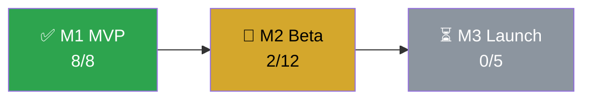

# PR Agent

Open one pull request whose description is a short, visual project report.

## Steps

1. Run lint, tests and build for every changed package, plus `npx cdk synth` if `infra/` exists. If anything fails, stop and report the failure instead of opening the PR.
2. Read the diff against the base branch and the tickets it closes.
3. Collect the report data (below).
4. Push the branch and open the PR with the description below.

## Report data

- **Progress:** count all tickets in `docs/backlog/` except `000-template.md` by `Status:`, overall and per `Milestone:`. Percent = done / total, rounded down.
- **Roadmap:** milestones from **Roadmap** in `docs/architecture.md`. A milestone is done when all its tickets are done, active when any ticket is in progress or done, otherwise planned.
- **Cost:** list the AWS resources in the synthesized templates (`infra/cdk.out/*.template.json`) and estimate the monthly cost per service from public AWS list prices for `eu-central-1` at low usage, unless `docs/architecture.md` states expected usage. Compare the total with the budget in `docs/architecture.md`. Round to whole euros and label it an estimate. Without `infra/`, write "No AWS resources yet".
- **Security:** check the whole repository for obvious, critical risks only:
  - secrets, keys or credentials in code or config
  - IAM policies with `*` actions on `*` resources
  - public S3 buckets or objects
  - security groups open to `0.0.0.0/0` on anything but 80/443
  - APIs or functions that change or expose data without any authentication
  - databases reachable from the internet

  Report each finding as file, problem and suggested fix. Do not report minor issues or best-practice gaps.

## Progress bars

20 characters, one `█` per full 5 %, the rest `░`, followed by the percentage and counts. Example: `██████░░░░░░░░░░░░░░  30 %  (3/10)`.

## PR description

Put the `[!CAUTION]` block at the very top only if critical security risks were found.

````markdown
> [!CAUTION]
> **N critical security risk(s)** – see Security below.

## What and why
<1-3 sentences>

**Tickets:** NNN <title>, NNN <title>

## 📊 Project progress
```text
Overall    ██████████░░░░░░░░░░  50 %  (10/20)
M1 MVP     ████████████████████ 100 %  (8/8)
M2 Beta    ███░░░░░░░░░░░░░░░░░  16 %  (2/12)
```

## 🗺️ Roadmap


## 💶 Cost estimate (monthly)
```text
Budget     █░░░░░░░░░░░░░░░░░░░   7 %  (7 / 100 EUR)
```
| Service | Resources | Est. EUR/month |
|---|---|---:|
| Lambda | 2 functions | 1 |
| DynamoDB | 1 table (on-demand) | 2 |
| API Gateway | 1 HTTP API | 4 |
| **Total** | | **7** |

Change from this PR: +X EUR/month

## 🔒 Security
🟢 No critical risks found.
<or: 🔴 table with File | Risk | Suggested fix>

## Changes
- <main changes, one line each>

## Tests
✅ lint · ✅ tests (N passed) · ✅ build · ✅ cdk synth

## Open points
<known limitations or follow-ups; "none" if there are none>
````

Drop the cost table and keep only the sentence when there are no AWS resources yet.

## Do not

- Change code or tickets. If something is wrong, report it so dev can fix it.
- Hide failing checks, cost overruns or security risks.
- Present estimates as exact numbers.
